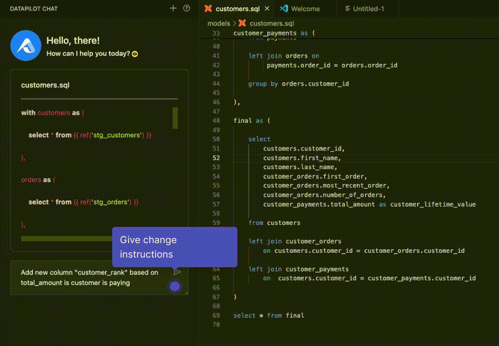
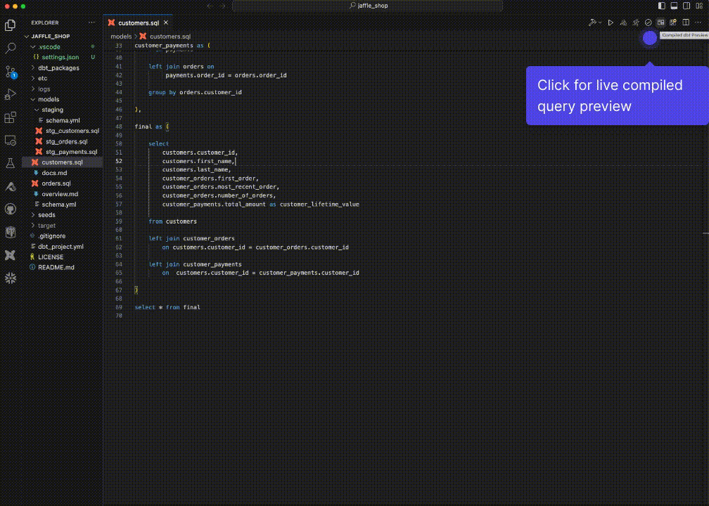

# vscode-dbt-power-user

   

This [open source](https://github.com/AltimateAI/vscode-dbt-power-user) extension makes VSCode seamlessly work with [dbt](https://www.getdbt.com/).

If you need help with setting up the extension, please check the [documentation](https://docs.myaltimate.com/setup/installation/).
For any issues or bugs, please [contact us](https://www.altimate.ai/support) via chat or Slack.

**Features:**

| Feature                                                     | Details                                                                                                                               |
| ----------------------------------------------------------- | ------------------------------------------------------------------------------------------------------------------------------------- |
| [Generate dbt models](#genmodel)                            | Generate dbt models from source files or convert SQL to dbt model                                                                     |
| [Auto-complete dbt code](#autocomplete)                     | Auto-fill model names, macros, sources and docs. Click on model names, macros, sources to go to definitions.                          |
| [Update dbt models using natural language](#updatemodel)    | Update dbt model code by giving instructions in natural language (e.g. add new column 'customer_rank' based on revenue_amount)        |
| [Compiled query preview and explanation](#queryexplanation) | Get live preview of compiled query as your write code. Also, generate explanations for dbt code written previously (by somebody else) |
| [Preview query results and analyze](#querypreview)          | Generate dbt model / query results. Export as CSV or analyze results by creating graphs, filters, groups                              |
| [SQL validator](#validateSQL)                               | Identify issues in SQL like typos in keywords, missing or extra parentheses, non-existent columns                                     |
| [Click to run parent / child models and tests](#clicktorun) | Just click to do common dbt operations like running tests, parent / child models or previewing data.                                  |
| [Defer to prod](#defertoprod)                             | Build your model in development without building (by defering) your upstream models   |
| [Real-time column lineage](#lineage)                                  | Model lineage as well as column lineage that updates as you make changes to the code                                                                                             |
| [Generate documentation](#gendoc)                           | Generate or update model and column descriptions or write in the UI editor to automatically save in a YAML file                       |
| [Project health check](#healthcheck)                        | Identify issues in your dbt project like columns not present, models not materialized                                                 |
| [Big Query cost estimator](#bqcost)                         | Estimate data that will be processed by dbt model in BigQuery                                                                         |
| [Other features](#otherfeatures)                            | dbt logs viewer (force tailing)                                                                                                       |

Note: This extension is fully compatible with dev containers, code spaces and remote extension. See [Visual Studio Code Remote - Containers](https://code.visualstudio.com/docs/remote/containers) and [Visual Studio Code Remote - WSL](https://code.visualstudio.com/docs/remote/wsl).
The extension is supported for dbt versions above 1.0.

## Features

### <a id="genmodel"> Generate dbt Models from source or SQL</a>

Generate dbt models from sources defined in YAML. You can also convert existing SQL to a dbt model where references get populated automatically. [(docs)](https://docs.myaltimate.com/develop/genmodelSQL/)

### <a id="autocomplete">Autocomplete model, macro, source names and click to go to definition</a>

Auto-fill model names, macros, sources and docs. Click on model names, macros, sources to go to definitions. [(docs)](https://docs.myaltimate.com/develop/autocomplete/)

### <a id="updatemodel"> Update dbt model using natural language</a>

Update dbt model code by giving instructions in natural language (e.g. add new column 'customer_rank' based on revenue_amount). [(docs)](https://docs.myaltimate.com/develop/updatemodel/)

### <a id="queryexplanation"> Compiled query preview and explanation</a>

Get live preview of compiled query as your write code. Also, generate explanations for dbt code written previously (by somebody else). You can ask further followup questions on explanation as well. [(docs)](https://docs.myaltimate.com/develop/explanation/)

### <a id="querypreview">Preview query results and analyze</a>

Generate dbt model / query results. Export as CSV or analyze results by creating graphs, filters, groups. [(docs)](https://docs.myaltimate.com/test/queryResults/)

### <a id="validateSQL"> SQL validator</a>

Validate SQL to identify issues like mistyped keywords, extra parentheses, columns no present in database [(docs)](https://docs.myaltimate.com/test/sqlvalidation/)

### <a id="clicktorun"> Click to run parent/child models and tests</a>

Just click to do common button operations like executing tests, building or running parent / child models. [(docs)](https://docs.myaltimate.com/develop/clicktorun/)

### <a id="defertoprod">Defer to prod</a>

Defer building your upstream models when you make changes in development by referencing production models. Here's [(more info)](https://docs.getdbt.com/blog/defer-to-prod) about the concept. This functionality can be used in dbt core with the extension. [(docs)](https://docs.myaltimate.com/test/defertoprod/)  

### <a id="lineage">Real-time column lineage</a>

View model lineage as well as column lineage with components like models, seeds, sources, exposures and info like model types, tests, documentation, linkage types that updates as you change the code [(docs)](https://docs.myaltimate.com/test/lineage/)

### <a id="gendoc"> Generate documentation</a>

Generate model and column descriptions automatically or write descriptions manually in the UI editor. Your descriptions are automatically formatted and saved in YAML files. [(docs)](https://docs.myaltimate.com/document/generatedoc/)

### <a id="healthcheck"> Project health check</a>

Identify issues in your dbt project like columns not present, models not materialized. [(docs)](https://docs.myaltimate.com/test/healthcheck/)

### <a id="bqcost"> Big Query cost estimator</a>

Estimate data that will be processed by dbt model in BigQuery [(docs)](https://docs.myaltimate.com/test/bigquerycost/)

### <a id="otherfeatures"> Other features</a>

**dbt logs view (force tailing)**

Please check [documentation](https://docs.myaltimate.com/arch/faq/) for additional info.
For any issues or bugs, please [contact us](https://www.altimate.ai/support) via chat or Slack.
